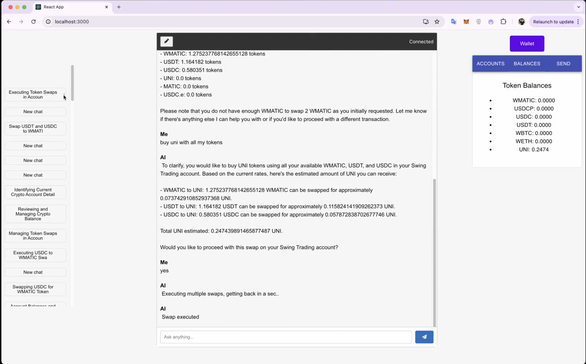

# Feelan

A decentralized application integrating Arweave, AO processes, Uniswap for token swaps, and NFT minting capabilities.

## Screenshots


*Screenshot from an earlier version of the project showing the chat-based trading interface with token balance management and automated swap execution.*

## Project Structure

- **irys_server/**: Backend server handling blockchain interactions
  - AO processes integration
  - Uniswap token swaps
  - NFT minting functionality
  - Query and messaging services

- **flask_app/**: API server
  - Handles routing and middleware
  - Connects frontend to blockchain services

- **app-ui/**: Frontend application
  - User interface for interacting with blockchain features
  - Wallet connection and management

## Setup Instructions

### Prerequisites
- Node.js (v16+)
- Python 3.8+
- Arweave wallet
- Polygon network access

### Environment Variables
Create a `.env` file in the `irys_server` directory with:
```
API_URL=<your_polygon_rpc_url>
PRIVATE_KEY=<your_private_key>
```

### Installation

1. Install backend dependencies:
```bash
cd irys_server
npm install
```

2. Install API server dependencies:
```bash
cd flask_app
pip install -r requirements.txt
```

3. Install frontend dependencies:
```bash
cd app-ui
npm install
```

### Running the Application

1. Start the blockchain services:
```bash
cd irys_server
node back_server.js
```

2. Start the API server:
```bash
cd flask_app
python app.py
```

3. Start the frontend:
```bash
cd app-ui
npm start
```

## License
MIT 
